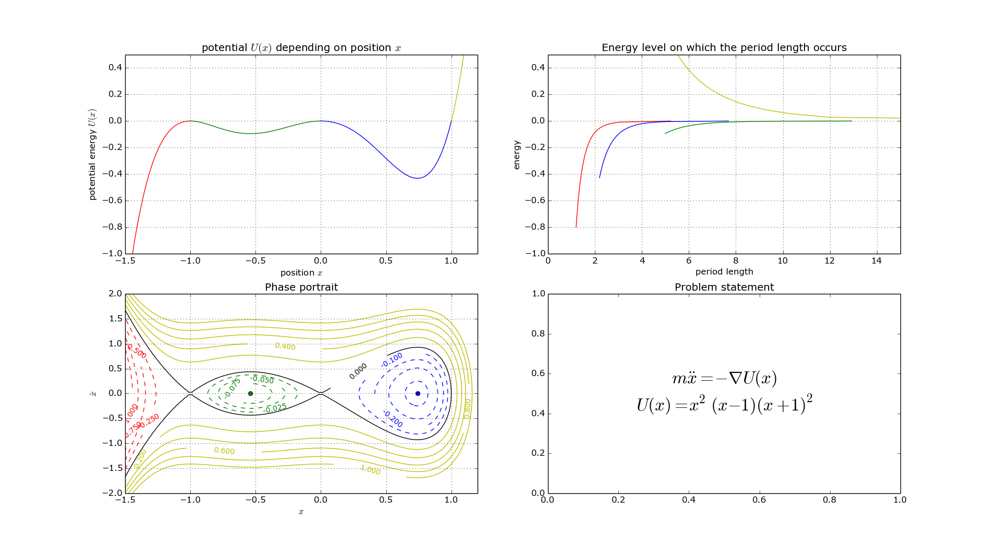
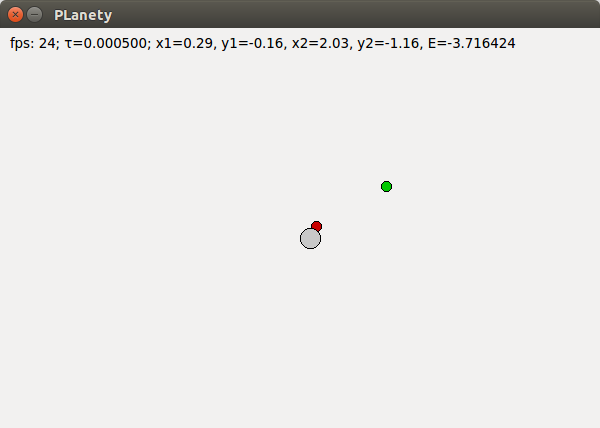
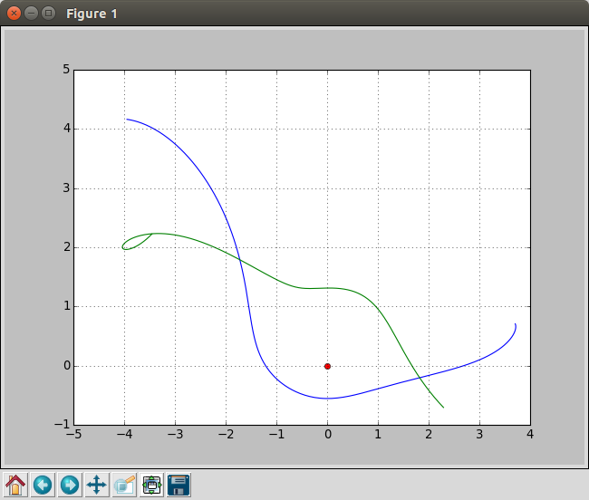
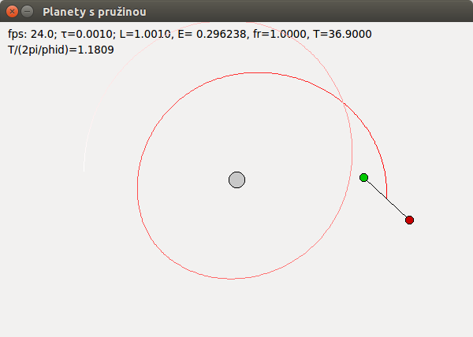

Fyz-sim
=======

Various simulations based on physical models, done mostly as school projects.

	python3 fyzsim1.py

	python3 fyzsim2.py

	python3 fyzsim3.py

	python3 fyzsim4.py

Dependencies
------------
python3
python3-pyqt4
python3-matplotlib
python3-scipy